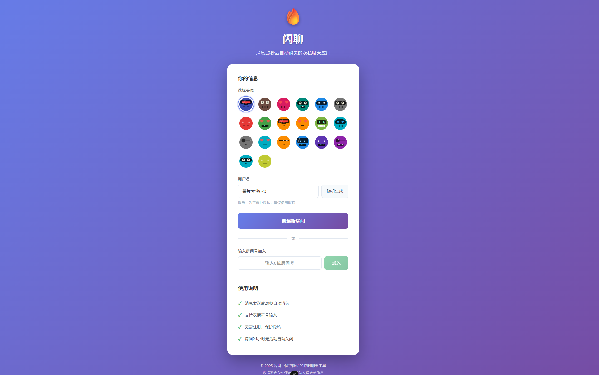
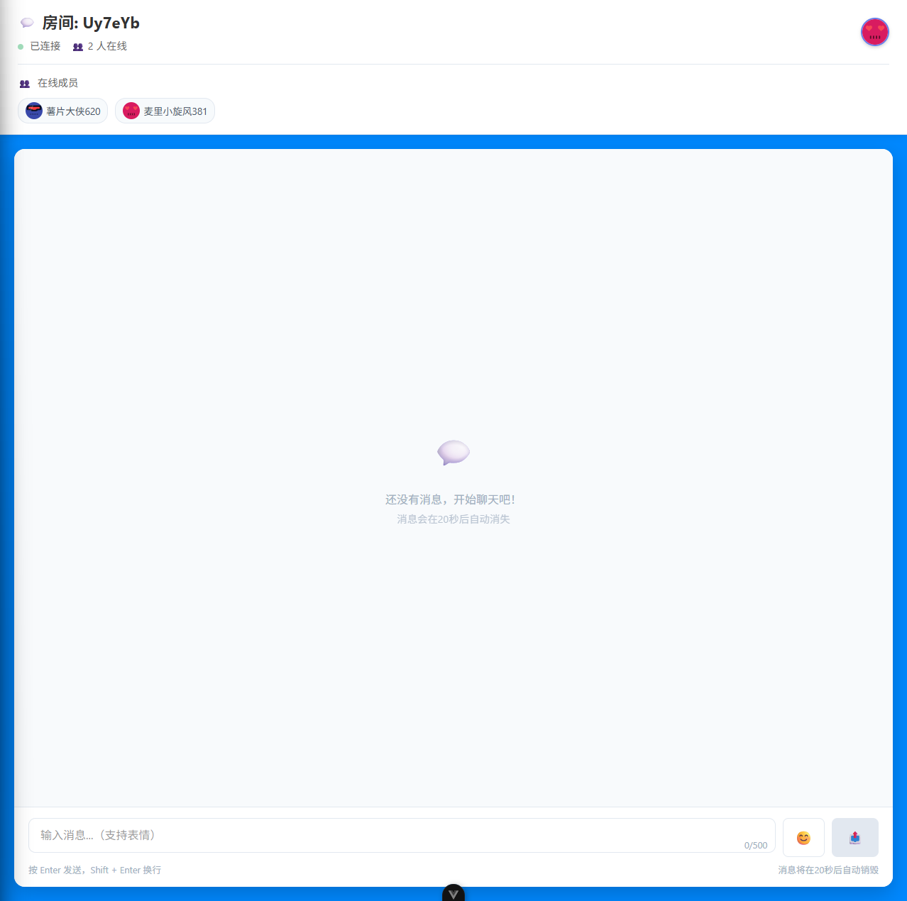
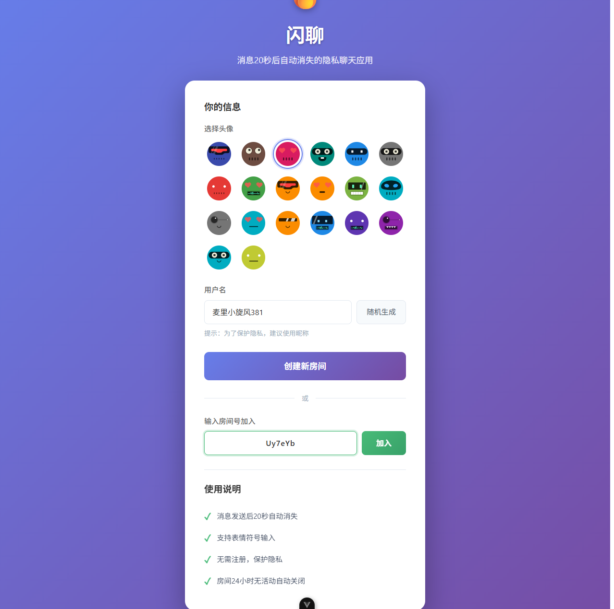
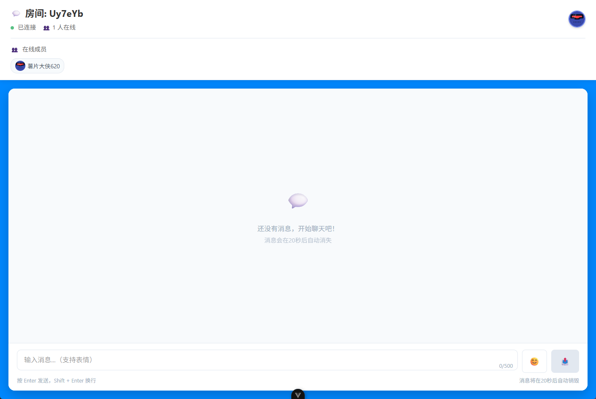
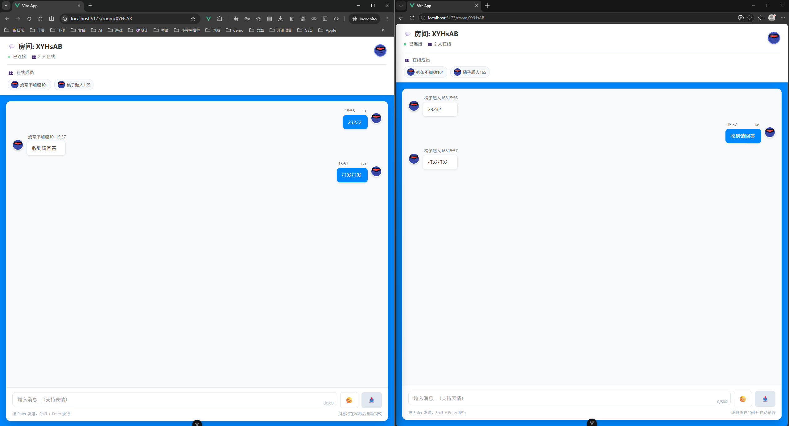
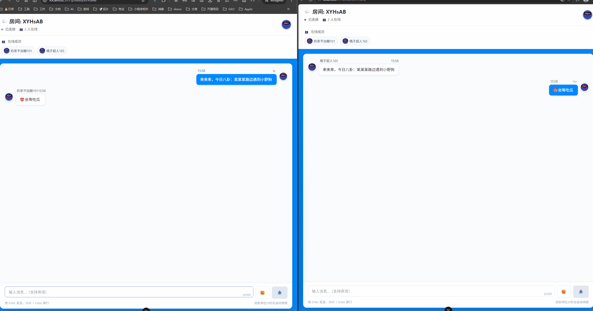
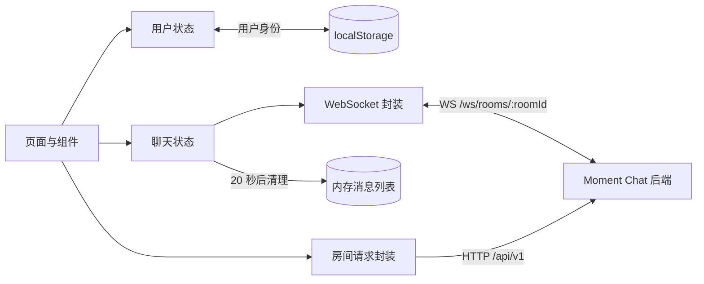

# Moment Chat 前端

Moment Chat 是一个轻量、即时、注重隐私的临时聊天室。用户无需注册账号，只需设置昵称和头像，即可创建一个 6 位房间号或加入已有房间；聊天消息会在展示 20 秒后自动消失，适合临时讨论、快速协作与短时信息交换。

本仓库是 Moment Chat 的 Web 前端，基于 Vue 3、TypeScript 和 Vite 构建，通过 REST API 管理房间，通过原生 WebSocket 完成实时消息、成员状态和输入状态同步。

## 功能特性

- 无需注册：首次访问自动生成用户 ID、随机昵称和默认头像，并保存至浏览器本地。
- 临时房间：一键创建房间，通过 6 位房间号快速加入。
- 实时通信：使用 WebSocket 收发消息、同步成员进出与输入状态。
- 阅后即焚：消息展示 20 秒后自动从会话列表移除，并显示倒计时进度。
- 在线成员：实时展示房间在线人数、昵称与头像。
- 快捷邀请：支持复制房间号和通过 URL 参数预填房间号。
- 表情输入：内置表情选择器，支持 Enter 发送、Shift + Enter 换行。
- 断线重连：非主动断开时，每 3 秒尝试重连，最多尝试 5 次。
- 响应式界面：适配桌面端与移动端浏览器。

## 项目示例

### 首页与身份设置

用户可选择头像、修改昵称，然后创建新房间或输入房间号加入会话。



### 创建与加入房间





### 房间与实时对话

房间页面展示在线成员、系统事件、实时消息以及消息剩余时间。





### 隐私消息自动删除

消息在前端保留 20 秒，倒计时结束后自动从当前会话中移除。



更多原始示例素材可在 [assets 目录](https://github.com/ylpxzx/moment-chat-frontend/tree/main/assets) 查看。

## 技术栈

| 类别 | 技术 | 用途 |
| --- | --- | --- |
| 应用框架 | Vue 3 | Composition API 与组件化视图 |
| 开发语言 | TypeScript | 类型检查与工程约束 |
| 构建工具 | Vite 7 | 本地开发、代理与生产构建 |
| 状态管理 | Pinia | 用户、房间、消息与连接状态 |
| 路由 | Vue Router | 首页及动态房间路由 |
| UI | Naive UI | 消息、对话框及基础组件 |
| 样式 | Tailwind CSS 4 + scoped CSS | 页面布局、响应式与交互样式 |
| 实时通信 | 原生 WebSocket | 消息和房间事件的双向传输 |
| 工程质量 | ESLint、Prettier、vue-tsc | 代码检查、格式化与类型检查 |

## 项目架构

```text
moment-chat-frontend/
├─ assets/                    # README 截图与演示动图
├─ public/                    # 静态公共资源
├─ src/
│  ├─ assets/                 # 应用样式与图形资源
│  ├─ components/             # 房间头部、消息列表、输入框、表情选择器
│  ├─ composables/
│  │  ├─ useRoom.ts           # 房间 REST API 封装
│  │  └─ useWebSocket.ts      # WebSocket 连接、发送与重连
│  ├─ router/index.ts         # 首页与动态房间路由
│  ├─ stores/
│  │  ├─ chat.ts              # 房间、消息、成员及连接状态
│  │  └─ user.ts              # 本地用户身份与头像
│  ├─ views/
│  │  ├─ HomeView.vue         # 用户设置、创建房间、加入房间
│  │  └─ RoomView.vue         # 实时聊天室主界面
│  ├─ App.vue                 # 全局 UI Provider 与主题配置
│  └─ main.ts                 # Vue、Pinia、Router 初始化
├─ vite.config.ts             # 插件、开发代理与构建拆包配置
├─ pnpm-workspace.yaml        # pnpm 构建脚本许可
└─ package.json               # 依赖与项目命令
```

### 数据流



## 实现细节

### 用户身份

`stores/user.ts` 在应用启动时读取 `localStorage` 中的 `burn-chat-user`。如果不存在，则生成随机昵称、用户 ID，并选取默认 DiceBear 头像。用户修改昵称或头像后会立即写回本地存储，因此刷新页面后仍能保持身份。

前端只在本地维护轻量身份信息，不包含传统账号、密码或登录流程。

### 房间管理

`composables/useRoom.ts` 封装房间相关 REST 请求：

| 方法 | 地址 | 作用 |
| --- | --- | --- |
| `POST` | `/api/v1/rooms` | 创建房间并返回房间号 |
| `GET` | `/api/v1/rooms/:roomId/check` | 检查房间是否存在 |
| `GET` | `/api/v1/rooms/:roomId/info` | 获取房间信息 |

首页会在加入前校验房间号格式和房间状态，成功后跳转到 `/room/:roomId`。

### WebSocket 通信

`composables/useWebSocket.ts` 根据当前页面协议自动选择 `ws://` 或 `wss://`，连接地址为 `/ws/rooms/:roomId`。连接建立后首先发送 `join` 事件，并将收到的数据交给聊天状态模块统一处理。

当前处理的服务端事件包括：

| 事件 | 前端行为 |
| --- | --- |
| `new_message` | 添加新消息并启动过期清理 |
| `user_join` | 更新房间与在线成员信息 |
| `user_leave` | 从在线成员列表移除用户 |
| `user_typing` | 展示输入状态，并在 3 秒后清除 |
| `system` | 添加系统提示消息 |

客户端可发送 `join`、`text` 和 `typing` 等消息。非主动断线时，连接层会以 3 秒为间隔自动重连，最多 5 次。

### 消息生命周期

聊天状态模块收到消息后会补齐 `id`、`timestamp` 和 `expiresAt`。每条消息默认保留 20 秒：既有针对单条消息的延时清理，也有每秒执行一次的过期消息兜底扫描。房间视图根据剩余时间渲染倒计时和进度条。

消息自动消失是当前客户端的展示策略；消息是否持久化及服务端保留周期由后端实现决定。

### 开发代理与生产构建

开发环境下，Vite 将请求转发至本地后端：

- `/api` → `http://localhost:8080`
- `/ws` → `ws://localhost:8080`

因此前端代码始终使用同源相对地址，无需在组件中写死后端域名。生产环境建议由同一网关或 Web 服务器转发 `/api` 与 `/ws`，并将前端 `dist` 目录作为静态站点发布。

生产构建会把 Vue、Vue Router 与 Pinia 拆入 `vendor` 代码块，并把 Naive UI 拆入独立 `ui` 代码块，以改善浏览器缓存利用率。

## 本地开发

### 环境要求

- Node.js `^20.19.0` 或 `>=22.12.0`
- pnpm
- Moment Chat 后端运行在 `http://localhost:8080`

### 安装依赖

```sh
pnpm install
```

项目已在 `pnpm-workspace.yaml` 中允许 `esbuild` 执行安装构建脚本。如 pnpm 仍提示构建脚本未批准，请确认该文件包含：

```yaml
allowBuilds:
  esbuild: true
```

### 启动开发服务器

```sh
pnpm dev
```

默认访问地址为 `http://localhost:5173`。

### 构建与检查

```sh
# 类型检查并生成生产构建
pnpm build

# ESLint 检查并自动修复
pnpm lint

# 格式化 src 目录
pnpm format

# 本地预览生产构建
pnpm preview
```

构建产物位于 `dist/`。

## 路由说明

| 路由 | 页面 | 说明 |
| --- | --- | --- |
| `/` | `HomeView` | 设置用户信息、创建或加入房间 |
| `/room/:roomId` | `RoomView` | 进入指定房间并建立 WebSocket 连接 |

也可以通过 `/?room=ABC123` 预填房间号，便于分享邀请链接。

## 注意事项

- 房间号必须为 6 位字母或数字。
- 浏览器需要允许使用 `localStorage`，否则用户身份无法跨刷新保留。
- 默认头像由 DiceBear 在线服务提供，离线环境下可能无法加载。
- WebSocket 反向代理必须启用 Upgrade/Connection 请求头转发。
- 本项目需要配合 Moment Chat 后端使用，单独启动只能展示前端页面，无法创建房间或实时聊天。

## 许可证

如需开源发布，请在仓库中补充明确的许可证文件与授权说明。
